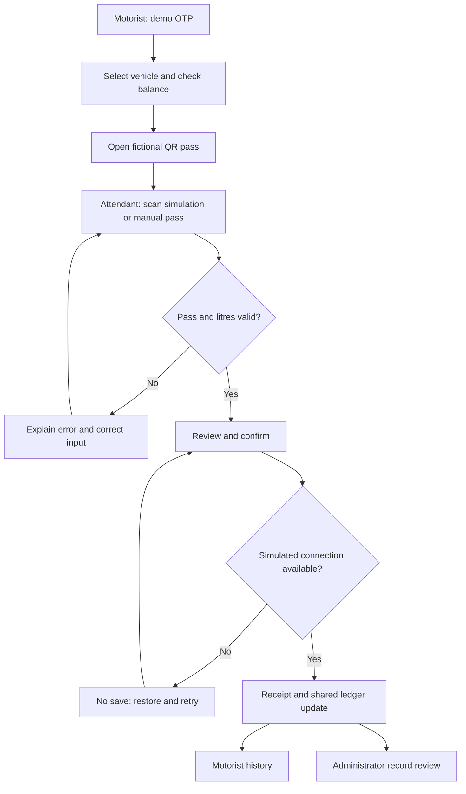

# Research, requirements and decision log
Group C · Final submission · 14 September 2026

## Evidence standard and sources
This is desk research, not field research. No interviews, quotations from participants, observed queues or participant findings are claimed. Earlier preparation records report the access results below. Current operational rules were not established for the submission date.

| Source | Publication / period | Access record | Supported statement and limit |
| --- | --- | --- | --- |
| [CPC launch announcement](https://ceypetco.gov.lk/2022/07/16/ministry-of-power-and-energy-launches-national-fuel-pass-to-streamline-fuel-distribution/) | 16 July 2022 | Full text reviewed 13 September 2026; indexed launch checked 14 September | Historical QR-based allocation and station transaction workflow; not current quota policy |
| [ICTA FAQ](https://www.icta.lk/uncategorized-ta/frequently-asked-questions-about-the-national-fuel-pass) | 2 August 2022 | Indexed information checked 13 September; full fetch unsuccessful | Supporting historical registration/OTP context; do not quote unaccessed details |
| [EconomyNext suspension report](https://economynext.com/sri-lanka-ends-qr-code-enabled-fuel-rationing-system-129774/) | 1 September 2023 | Full text reviewed 13 September 2026 | Historical suspension, not proof of present discontinuation |
| [Ministry of Energy reimplementation notice](https://energymin.gov.lk/index.php/2026/03/15/news-07-15-03/) and [news index](https://energymin.gov.lk/index.php/news/) | 15 March 2026 | Indexed notice reviewed 13 September; Ministry indexed result checked 14 September; full article fetch previously timed out | Official indexed announcement of reimplementation; no submission-date quota/price/eligibility confirmation |
| [DCS Computer Literacy 2024](https://www.statistics.gov.lk/Resource/en/ComputerLiteracy/Bulletins/AnnualBuletinComputerLiteracy-2024.pdf) | 2024 statistics | Full bulletin reviewed 13 September 2026 | Computer literacy 35.9%, digital literacy 65.0% among ages 5–69; 19.1% of households owned desktop/laptop. Different measures/populations; not smartphone ownership or prototype competence |
| [Official language policy](https://pubad.gov.lk/web/index.php?Itemid=193&id=117&lang=en&option=com_content&view=article) | Policy reference | Reviewed 13 September 2026 | Sinhala/Tamil official languages; English link language |
| [WCAG 2.2 quick reference](https://www.w3.org/WAI/WCAG22/quickref/) | Accessibility guidance | Consulted 13 September 2026 | Design/evaluation reference, not certification of this app |

## Problem statement
How might we help motorists and station staff understand and complete a fuel-pass transaction, while making its resulting record clear to an administrator?

## Findings versus hypotheses
| Type | Statement | Design implication / next evidence |
| --- | --- | --- |
| Published evidence | The historical workflow uses a vehicle-linked QR pass and records issued quantities | Keep pass identity, validation and transaction record connected |
| Published evidence | Language policy and national literacy data make a single-language, high-confidence-user assumption unsuitable | Offer draft core language options and plain labelled controls; test with actual users |
| Source inspection | React shares one browser-local ledger across three role views | Demonstrate consistency, without claiming cross-device integration |
| Design hypothesis | A prominent remaining balance could reduce uncertainty | Ask participants to interpret allocation, usage and remaining litres |
| Design hypothesis | A review step could help prevent unintended litre entry | Observe correction before confirmation |
| Design hypothesis | An explicit interruption message could reduce repeated submissions | Test understanding of whether a failed save changed the balance |
| Design hypothesis | Shared devices create sign-out and persistence concerns | Use no personal data; explain reset; investigate real household practices |
| Design hypothesis | Attendants may use small screens under time pressure or weak connectivity | Prioritise clear validation and touch targets; no field observations claimed |

## Provisional personas — assumptions, not research participants
| Working role | Assumed context | Need | What must be validated |
| --- | --- | --- | --- |
| Motorist checking a family vehicle | May use a shared phone; may prefer Sinhala or Tamil | Recognise the selected vehicle and remaining allowance; present the pass | Actual device sharing, language and reading needs |
| Station attendant | May use a small screen during a busy shift | Verify pass, enter litres accurately and know whether saving succeeded | Station workflow, supervision, device and network constraints |
| Operations reviewer / station manager stakeholder | Reviews records on a wider display | Move from totals to a transaction and understand why it needs review | Actual reporting permissions, audit responsibilities and useful filters |

## Historical and proposed journeys
These are documentation diagrams, not evidence of participant workshops.

| Stage | Documented historical workflow | Implemented proposal | Boundary |
| --- | --- | --- | --- |
| Access | Register and obtain a vehicle-linked pass | Demo OTP and two fictional vehicles | No NIC/phone verification or real registration |
| Before fuel | Obtain/download/print pass; check allocation through documented channels | Visible remaining amount, QR view and history | Browser display only; no official entitlement |
| At station | Present pass; station scans and checks allocation | Simulated scan or manual identifier | No camera scanning or government lookup |
| Dispense | Record issued quantity | Validate litres, review, confirm receipt | Local transaction; no real fuel |
| Afterwards | Recorded issue and balance/confirmation | Updated motorist history and admin sample record | One tab/browser; derived audit text |

OTP errors return to entry/resend. Duplicate receipt replay returns a rejection and leaves the ledger unchanged. Reset restores deterministic seed records.

## Prioritised requirements and assumptions
| ID / priority | Requirement or assumption | Current scope / evidence |
| --- | --- | --- |
| R1 Must | Motorist OTP, vehicle, allowance, QR, history | Implemented in app/page.tsx |
| R2 Must | Attendant validation, litres, review, receipt | Implemented; local simulation |
| R3 Must | Admin totals, station filter, record review | Implemented; sample data and derived audit |
| R4 Must | Consistent balance and duplicate handling | lib/demo.ts; dated prior checks, current rerun pending |
| R5 Must | Invalid/expired OTP, unknown pass, invalid/excess litres, interruption, empty history | Implemented scenarios; demo plan documents recovery |
| R6 Must | Proposal/demo labels and no real personal records | Source-backed; recheck final build rendering |
| R7 Should | Core English/Sinhala/Tamil and accessible responsive controls | Implemented draft copy; fuller review pending |
| R8 Must for design deliverable | Native editable Figma core screens and connected prototype | Partial: native sign-in, other image-based frames, wiring unverified |
| R9 Must for submission | Current app/source/design/AI links and article | AI/playback links missing; publication figures pending |
| R10 Deferred | Full onboarding/registration, notifications, finder, transfer/request, separate operator login | Not implemented; earlier expanded wish list must not be presented as completed |
| A1 | Demo allocations 30 L car / 5 L bike | Fictional values, not policy |
| A2 | All roles share one browser tab | Deliberate demonstration constraint |
| A3 | No backend/secrets/paid API | Core journeys use local state; production work separate |

## Major design decisions
| Decision | Problem addressed | Trade-off |
| --- | --- | --- |
| Balance beside vehicle identity | Avoid ambiguous entitlement display | Must still test comprehension |
| Review before dispensing confirmation | Catch entry mistakes before deduction | Adds a step; no measured speed claim |
| Manual pass entry alongside simulated scan | Reliable classroom demo | Does not validate camera usability |
| Receipt plus shared history/admin record | Show what changed after confirmation | Local data only |
| Explicit simulated interruption | Explain retry without silently deducting | No offline operation or real network test |
| Navy/teal tokens and 48px primary controls | Consistency, hierarchy and touch use | Contrast and screen-reader review still needed |
| Draft language selector | Recognise language needs | Some supporting/audit prose remains English |
| No real identity data | Demonstrate without collecting records | Cannot evaluate real eligibility workflows |

## Success criteria — targets, not measured results
| Criterion | Proposed target | Measurement |
| --- | --- | --- |
| Explain remaining car allowance | 4/5 participants without assistance | Ask before any hints; record exact interpretation |
| Open QR from selected vehicle | 4/5 unaided; median under 30 seconds | Start timing at vehicle selection; record failures too |
| Issue 5 L correctly | 4/5 unaided, one recorded transaction | Observe entry/review/receipt, compare ledger |
| Recover from invalid input | 4/5 recover without moderator instruction | Assign a scenario and record assistance |
| Understand interrupted save | 4/5 correctly say balance is unchanged | Ask before restoring simulated connection |
| Technical consistency | Exactly 13 L remaining and 3 total transactions after one 5 L issue | Regression/browser check, separate from user metrics |

Five participants provide formative feedback, not population-level validation. Do not replace targets with results until sessions are actually conducted.
